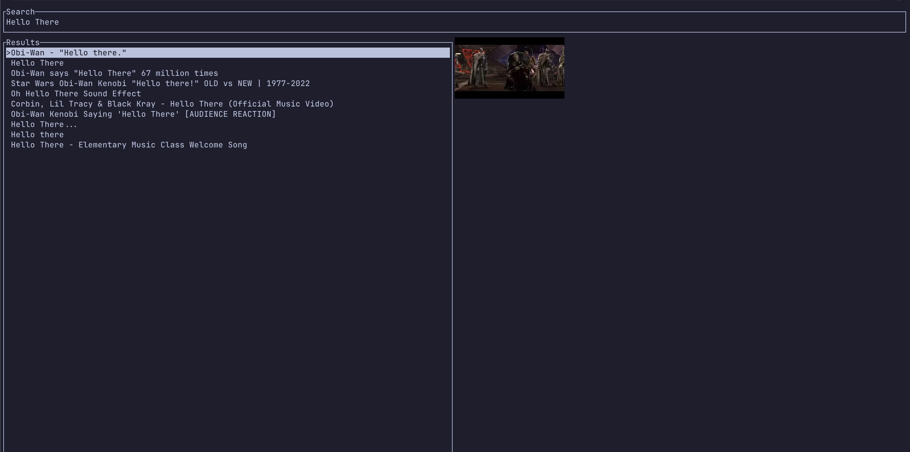

# Youtuber

A CLI app to watch YouTube from your your terminal.



Use vim keybindings for navigation, `i` to start searching, `j` and `k` to
navigate selections up and down, `enter` to select a video to watch.

## Requirements

- [IINA](https://iina.io/) or [MPV](https://mpv.io/)

## Installation

You can install this by either building from source:

```bash
git clone https://github.com/JJGOD-13/youtuber.git
cd youtuber
cargo build && cargo run
```

Or from Cargo

```bash
cargo install youtuber
```

> [!IMPORTANT]
> Currently only tested on MacOS.

## Contributing

Feel free to open up PR's if you want some kind of functionality :)
